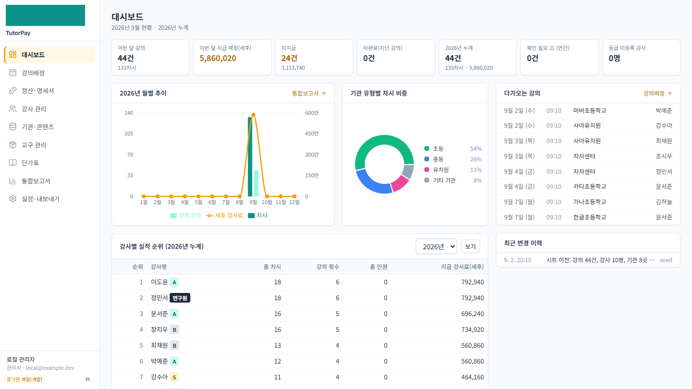
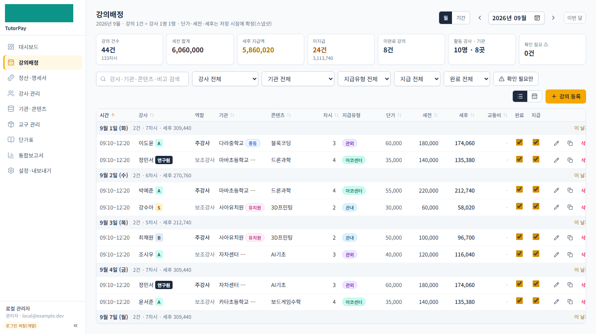
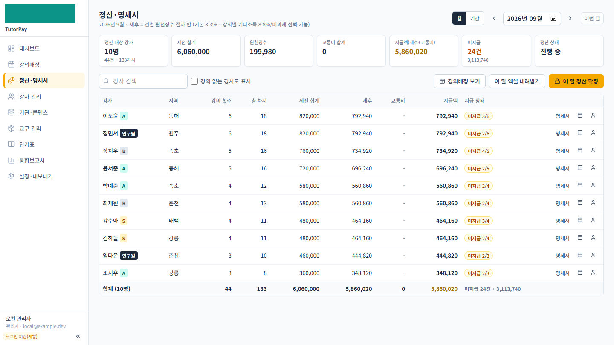
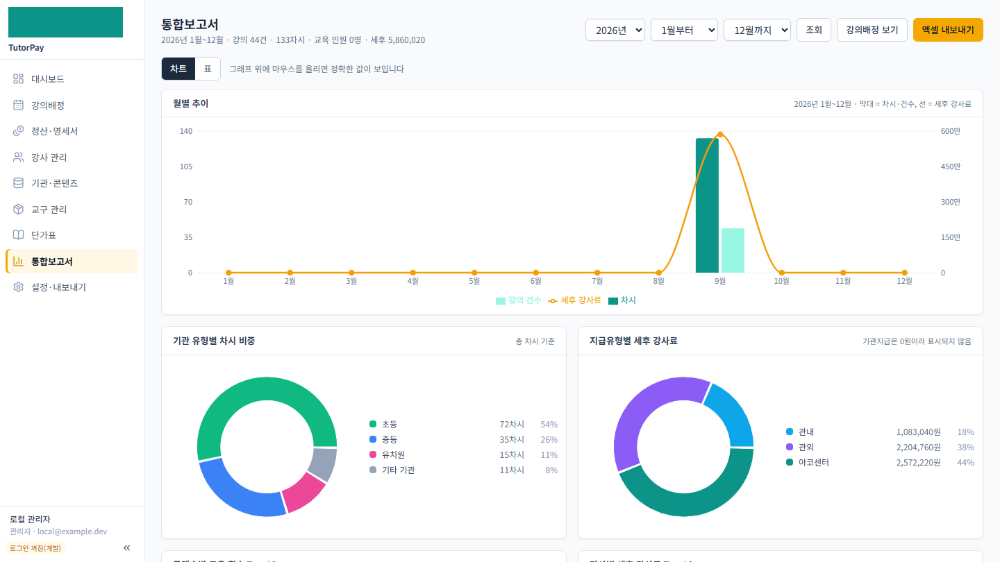

# 💰 TutorPay — 강사 배정·급여정산 관리 시스템


출강 수업(방과후·기관 강의)의 **강사 배정 → 단가 계산 → 월별 정산·명세서 → 통합보고서**를 한 곳에서 처리하는 웹앱입니다.
구글 시트로 관리하던 강사 100여 명·연 수백 건의 강의 데이터를 이전해 실무에서 사용하는 시스템입니다.

## 스크린샷

> 아래 그림은 모두 **가상 데이터**입니다 (실제 강사·기관 정보 없음).

| | |
|---|---|
| **대시보드** — 월 현황·연 누계·강사별 실적  | **강의배정** — 일자별 강의·단가·세전/세후 스냅샷  |
| **정산·명세서** — 강사별 월 정산, 원천징수, 엑셀 내려받기  | **통합보고서** — 월별 추이·기관 유형·지급유형 차트  |

## 주요 기능

- **강의배정**: 일자별 강의 등록/복제, 강사·기관·콘텐츠 연결, 완료/지급 체크
- **단가 자동 계산**: 등급(S/A/B/연구원) × 지급유형(관내/관외/센터…) × 역할(주/보조) 단가표 + 시행일 기반 **단가표 버전 관리** — 과거 강의 금액은 스냅샷으로 보존
- **차시 구간 규칙**: 주당 1~2차시/3차시 이후 차등 단가, 지역 특례 등 급여 규칙을 마이그레이션으로 관리
- **정산·명세서**: 강사별 월 정산(세전/원천징수 3.3%·8.8%/비과세), 명세서 출력, 엑셀 내보내기, 월 정산 확정(잠금)
- **통합보고서**: 월별 추이, 기관 유형·지급유형별 비중, 강사 실적 순위 (Recharts)
- **관리**: 강사(등급·지역·서류), 기관·콘텐츠, 교구 재고까지 마스터 데이터 일원화
- **시트 이전 도구**: 기존 구글 시트(xlsx)를 정규화 JSON 으로 추출해 검증 후 일괄 적재 (`scripts/extract_from_sheet.py` → `db:seed`), 계산 불일치 자동 대조
- **인증**: Google OAuth(NextAuth v5) + 허용 이메일 화이트리스트, 로컬 개발용 인증 우회 모드

## 아키텍처 (AWS 배포 구성)

```
사용자 ──HTTPS──▶ Caddy (자동 TLS) ──▶ Next.js (App Router, 서버 액션)
                     │                        │ Drizzle ORM
                EC2 (Docker Compose) ─────▶ PostgreSQL 16
                     │                     (컨테이너 볼륨 또는 RDS)
                 백업: pg_dump → gzip → S3 sync (주 1회 cron)
```

- **EC2 + Docker Compose**: `docker-compose.yml` 하나로 앱·DB·리버스 프록시(Caddy, TLS 자동 발급)까지 기동
- **RDS 전환 옵션**: `DATABASE_URL` 만 RDS 엔드포인트로 바꾸면 됨 (앱은 접속 문자열 외 의존 없음)
- **백업**: `scripts/backup.sh` — pg_dump를 gzip 후 보관(기본 90일), S3 동기화 명령 포함
- **도메인/TLS**: Route 53 + Caddy TLS-ALPN 자동 인증서 (`DOMAIN` 환경변수)

## 로컬 실행

```bash
cp .env.example .env          # AUTH_DISABLED=true 로 로그인 없이 로컬 관리자 동작
docker compose -f docker-compose.local.yml up -d   # PostgreSQL 만 컨테이너로
npm ci
npm run db:migrate
npm run db:seed               # data/tutorpay-seed.json (가상 샘플 데이터)
npm run dev                   # http://localhost:3000
```

배포(서버): `.env` 에 실제 도메인·인증 정보 설정 후 `docker compose up -d --build`

## 기술적 특징

- **금액 스냅샷 설계** — 단가표가 개정돼도 이미 확정된 강의 금액은 변하지 않도록, 강의 저장 시점의 단가·세전·세후를 스냅샷으로 기록. 단가표는 시행일(effective_from) 기반 버전 테이블로 관리
- **급여 규칙의 마이그레이션화** — 요율 개편(차시 구간·지역 특례·신규 지급유형)을 SQL 마이그레이션으로 남겨 언제 무엇이 바뀌었는지 추적 가능, 멱등 실행 안전
- **시트 → DB 이전 파이프라인** — 추출 스크립트가 시트 캐시값과 재계산 값을 대조해 불일치를 보고, 원본 공란은 임의로 채우지 않고 경고로 노출
- **서버 액션 기반 CRUD** — Next.js App Router 서버 액션으로 API 레이어 없이 타입 안전한 데이터 흐름, Drizzle 스키마가 단일 출처
