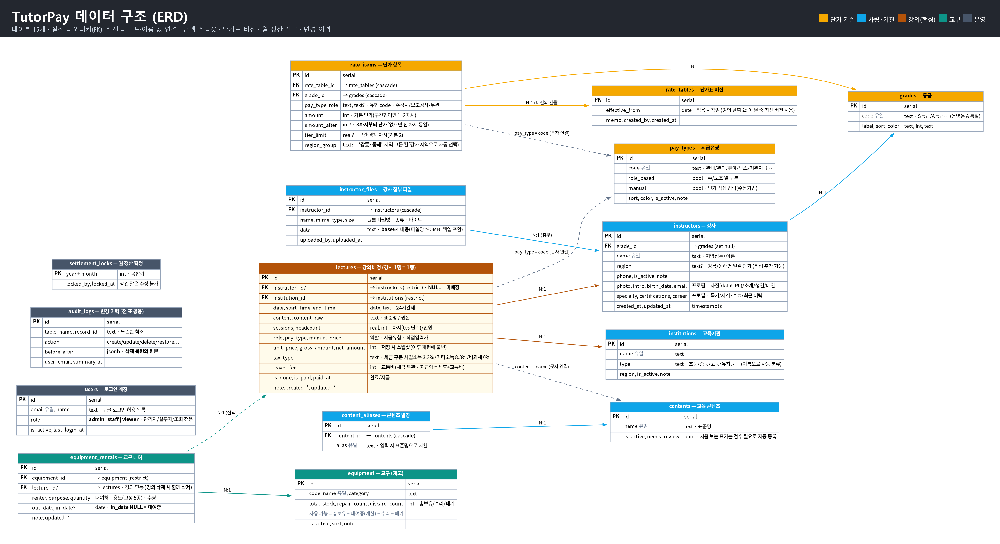
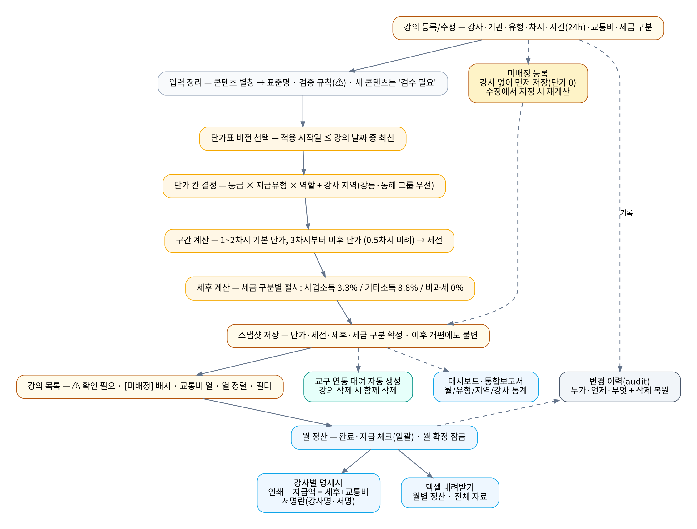
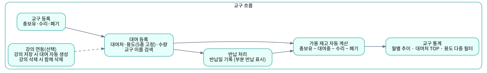

# TutorPay — 데이터 모델 · 데이터 흐름 · 설계 결정

> 원칙 한 줄: **시스템이 원본, 시트·엑셀은 사본.** 저장 순간의 금액이 스냅샷으로 확정되어 이후 단가 개편·등급 변경에 소급되지 않고, 모든 변경은 이력으로 남아 복원할 수 있다.

## 1. 데이터 모델 (ERD)

테이블 15개를 다섯 묶음으로 나눈다.

| 묶음 | 테이블 | 역할 |
| --- | --- | --- |
| 단가 기준 | `grades` · `pay_types` · `rate_tables` · `rate_items` | 단가표 **버전**(`effective_from`)과 칸(등급 × 지급유형 × 역할 × 지역 그룹). 구간 단가는 `amount` / `amount_after` / `tier_limit` |
| 사람·기관 | `instructors` · `instructor_files` · `institutions` · `contents` · `content_aliases` | 마스터 데이터. 콘텐츠는 표준명 + 별칭, 처음 보는 표기는 `needs_review` 로 자동 등록 |
| 강의(핵심) | `lectures` | 강사 1명 = 1행. `unit_price` · `gross_amount` · `net_amount` · `tax_type` 을 **저장 시점 스냅샷**으로 보관. `instructor_id` NULL = 미배정 |
| 교구 | `equipment` · `equipment_rentals` | 가용 재고는 컬럼이 아니라 계산값(총보유 − 대여중 − 수리 − 폐기). `lecture_id` 로 강의와 연동 |
| 운영 | `users` · `audit_logs` · `settlement_locks` | 권한 3단계, 변경 이력(`before` / `after` jsonb), 월 정산 확정 잠금(`year` + `month` 복합키) |

**참조 무결성 규칙**

- `lectures → instructors / institutions` 는 `restrict` — 강의가 연결된 강사·기관은 삭제가 거부된다(급여 기록 보호).
- `rate_items → rate_tables / grades`, `content_aliases → contents`, `instructor_files → instructors` 는 `cascade` — 부모에 종속된 값.
- `equipment_rentals → lectures` 는 강의 삭제 시 연동 대여를 함께 정리하고, 대여 이력은 `audit_logs` 에서 개별 복원한다.
- `lectures.pay_type`, `lectures.content` 는 FK 가 아니라 **값으로 보관**한다. 스냅샷 원칙과 같은 이유로, 지급유형·콘텐츠 마스터를 나중에 고치거나 지워도 과거 강의 행이 바뀌지 않아야 하기 때문이다.

## 2. 데이터 흐름

### 강의 등록 → 급여 계산 → 정산 → 명세서

1. **입력 정리** — 콘텐츠 별칭을 표준명으로 치환하고, 차시 공란·단가 누락·미배정·등급 미등록은 경고로 목록에 노출한다.
2. **단가 결정** (`src/lib/calc.ts`) — `findRateTable`(적용 시작일 ≤ 강의일 중 최신 버전) → `pickRateItem`(등급 × 지급유형 × 역할, 강사 지역 그룹 칸 우선) → `grossOfItem`(경계 차시까지 기본 단가, 이후 구간 단가, 0.5차시 비례).
3. **세후** — `netOf` 가 세금 구분별(사업소득 3.3% / 기타소득 8.8% / 비과세)로 원 단위 절사. 교통비는 과세와 무관하게 더한다.
4. **스냅샷 저장** — 계산은 **서버에서만** 다시 수행한다(화면에서 넘어온 금액은 신뢰하지 않음). 결과를 강의 행에 확정하고 조회 시 재계산하지 않는다.
5. **정산** — 강사별 월 합계, 일괄 지급 처리, 월 확정 잠금. 잠긴 달은 등록·수정·삭제·지급 변경이 모두 서버에서 차단된다.
6. **산출물** — 강사별 명세서(인쇄/PDF), 월·기간·연간 엑셀, 대시보드·통합보고서.

### 교구

강의 저장 시 붙인 교구는 대여 기록이 자동 생성되고, 가용 재고는 대여 기록에서 계산한다.

## 3. 설계 결정 기록

| # | 영역 | 결정 | 이유 |
| --- | --- | --- | --- |
| 1 | 구조 | 구글 시트 7장을 DB 로 완전 이전, **시스템 = 원본** | 시트 수식의 소급 재계산·중복·결측 0원 처리 문제 제거 |
| 2 | 계산 | **스냅샷 원칙** — 저장 시 금액 확정, 이후 소급 없음 | 단가표·등급 수정이 이미 지급한 정산을 바꾸면 안 된다 |
| 3 | 계산 | 단가표 **버전제**(`effective_from`) — 개편은 새 버전 추가로만 | 과거 버전을 덮어쓰지 않아 어느 날짜든 같은 결과를 재현 |
| 4 | 계산 | 금액은 **서버에서만 계산** — 클라이언트 값은 표시용 | 화면 조작·낡은 탭으로 잘못된 금액이 저장되는 경로 차단 |
| 5 | 데이터 | 시트 결측은 임의 보정 없이 **경고로 노출** | 추정값이 급여에 섞이는 것보다 사람이 검수하는 편이 안전 |
| 6 | 데이터 | 콘텐츠 **표준명 + 별칭**, 모르는 표기는 검수 필요로 자동 등록 | 표기 변형(같은 콘텐츠의 서로 다른 이름) 때문에 집계가 갈라지는 문제 |
| 7 | 검증 | 이전 완료 조건 = 기존 시트 **558건 재계산 대조 불일치 0건** | 전환 신뢰 확보. 요율 개편 뒤에도 같은 대조를 다시 실행 |
| 8 | 권한 | **3단계**(admin / staff / viewer), 초기 관리자는 화면에서 끌 수 없음 | 실무자 입력은 허용하되 계정 관리는 분리, 전원 잠금 사고 방지 |
| 9 | 무결성 | 강사·기관 삭제는 강의 연결 시 **DB 에서 거부**(`restrict`) | 급여 기록 보호를 애플리케이션이 아니라 제약으로 보장 |
| 10 | 무결성 | 교구 대여 용도는 **고정 5종** — 기존 변형 표기는 마이그레이션으로 정리 | 자유 입력이 만든 표기 변형을 원천 차단 |
| 11 | 세금 | **세금 구분을 강의 행마다 저장**(3.3 / 8.8 / 0%) | 같은 강사도 건별로 소득 구분이 달라질 수 있고, 이것도 스냅샷 대상 |
| 12 | 이력 | 모든 변경을 `audit_logs` 에 `before` / `after` jsonb 로 기록, 삭제는 복원 가능 | 급여 데이터는 "누가 언제 무엇을" 이 항상 답해져야 한다 |
| 13 | 정산 | **월 확정 잠금** — 잠긴 달은 서버에서 모든 쓰기 차단 | 지급이 끝난 달의 사후 수정 방지 |
| 14 | 배포 | 마이그레이션은 **컨테이너 시작 시 자동 적용**, 배포 전 3중 검증 | 아래 4절 |
| 15 | 안정성 | 새 설치에서 개편 단가표가 비는 잠복 버그 수정 — 시드가 개편 버전까지 보장 | 빈 DB 검증에서 발견. 서버 이전 시 그대로 재현 가능해야 한다 |
| 16 | 네트워크 | Caddy 는 **443 만 사용**, TLS-ALPN 챌린지로 인증서 발급 | 80 포트를 쓸 수 없는 서버 조건에서도 자동 TLS 유지 |

## 4. 마이그레이션 3중 검증

요율 개편을 SQL 마이그레이션으로 관리하면서, 마이그레이션 하나가 실패해 앱 컨테이너가 재시작을 반복하고 프록시가 502 를 돌려준 일이 있었다. 이후 배포 전 검증을 절차로 고정했다.

1. **기존 DB 에 적용** — 운영 데이터 사본에 새 마이그레이션이 통과하는지
2. **재실행 무해(멱등)** — 같은 마이그레이션을 다시 돌려도 결과가 같은지
3. **빈 DB 에서 처음부터 전체 생성** — 0000 부터 끝까지 순서대로 통과하는지

세 경우 모두 `마이그레이션 완료` 로그를 확인한 뒤에만 배포한다. 15번 결정(시드 버그)은 3번 검증에서 발견됐다.
